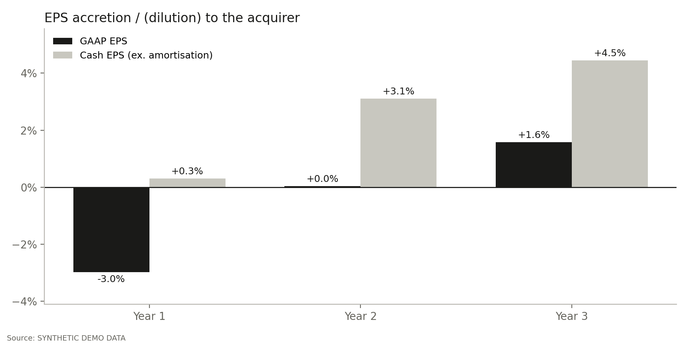

# Accretion / Dilution Merger Model

**Author:** Alessandro Radice · M.Sc. Economics and Business Law (Finance), Università Cattolica del Sacro Cuore, Milan

**Does the deal create value for the acquirer's shareholders?**
A Python merger model that takes two tickers and a set of deal terms. It produces the analysis an M&A team brings to a board: sources and uses, purchase price allocation, three years of pro forma EPS, breakeven synergies and sensitivities, in an **Excel model with live formulas**.



---

## Objective

Before any acquisition is announced, the acquirer's board asks one question first: **will this deal increase or dilute our earnings per share, and what has to go right for it to work?**

This project has three goals:

1. **Model a public-to-public acquisition end to end.** Offer, consideration mix, funding, purchase price allocation and pro forma earnings, from one configuration cell.
2. **Show what drives the answer.** Sensitivities on premium, cash/stock mix and synergies, plus a "cost of currency" comparison that explains why a deal is accretive or dilutive before any number is calculated.
3. **Deliver it in banker format.** An auditable Excel model where every output, including each sensitivity cell, is a live formula that reconciles with the Python engine.

---

## What it does

| Step | Module | What it produces |
|---|---|---|
| 1 | **Market data** | Price, diluted shares, consensus NTM EPS, debt, cash, EBITDA, revenue and book equity for acquirer and target (Yahoo Finance) |
| 2 | **Offer & consideration** | Offer price and premium, equity and enterprise value, implied EV/EBITDA and P/E, cash/stock split, exchange ratio |
| 3 | **Sources & uses** | Cash consideration funded first from excess balance-sheet cash, then new debt grossed up for financing fees; new shares issued at the acquirer's price |
| 4 | **Purchase price allocation** | Excess purchase price, intangible write-up, deferred tax liability, goodwill, annual amortisation |
| 5 | **Pro forma EPS** | Years 1–3: combined net income, phased synergies, interest on new debt, interest forgone on cash, amortisation, taxes, pro forma shares; GAAP and cash EPS accretion/dilution |
| 6 | **Breakeven synergies** | Pre-tax synergies needed each year for the deal to be EPS neutral |
| 7 | **Sensitivities** | Year 2 accretion by premium × % stock and by synergies × % stock |
| 8 | **Ownership & credit** | Pro forma ownership vs contribution (revenue, EBITDA, net income), pro forma net debt / EBITDA |
| 9 | **Exports** | Excel model with live formulas and an accretion chart |

### The Excel model (5 sheets)
`Inputs` · `Transaction` · `Pro Forma` · `Sensitivity` · `Ownership & Credit`, plus a sources & uses check that must equal zero.

- Banker colour code: **blue** = hard-coded input, **black** = formula, **green** = link.
- Change the premium, the stock mix, the cost of debt or the synergies, and every output recalculates, including the 50 sensitivity cells.

---

## Demo result (synthetic data)

| | Year 1 | Year 2 | Year 3 |
|---|---|---|---|
| GAAP EPS accretion / (dilution) | −3.0% | +0.0% | +1.6% |
| Cash EPS accretion (ex. amortisation) | +0.3% | +3.1% | +4.5% |
| Synergies achieved (pre-tax, $m) | 200 | 400 | 500 |
| Breakeven synergies (pre-tax, $m) | 432 | 397 | 360 |

A 30% premium, half cash and half stock: dilutive in year one, breakeven in year two and accretive from year three, as synergies phase in. The acquirer's stock (5.3% earnings yield) and new debt (4.6% after tax) both cost more than the 4.4% earnings yield bought at the offer price, so without synergies the deal dilutes.

---

## What you need

| Requirement | Details |
|---|---|
| **Environment** | A Google account to run the notebook in [Google Colab](https://colab.research.google.com), free tier is enough. It also runs in any local Jupyter with Python 3.10+. |
| **Python libraries** | `pandas`, `numpy`, `matplotlib`, `yfinance`, `xlsxwriter`. The first cell installs the missing ones. |
| **Data** | Yahoo Finance via `yfinance`. No API key and no paid subscription. |
| **Optional data** | Broker consensus EPS, the latest 10-K/10-Q for debt and share count, and a synergy estimate from comparable deals. |
| **To open the outputs** | Microsoft Excel or Google Sheets. |
| **Background knowledge** | EPS, enterprise vs equity value, basic accounting for acquisitions (goodwill, purchase price allocation). |

---

## How to run it

1. Open `Merger_Model.ipynb` in Google Colab.
2. In the **Configuration** cell, set the two companies:
   ```python
   ACQUIRER = "MDLZ"
   TARGET   = "HSY"
   ```
3. Adjust the deal terms in the `DEAL` dictionary: premium, % stock, cost of debt, synergies and phase-in, write-up and life.
4. `Runtime → Run all`. The Excel model and the chart download automatically.

**Offline mode:** `DATA_MODE = "demo"` runs on two synthetic companies. The notebook also falls back to demo mode if Yahoo Finance is unreachable, and every output is then labelled *SYNTHETIC DEMO DATA*.

---

## Methodology & validation

- **Funding:** cash consideration plus advisory fees are paid from excess cash first, then new debt; financing fees are grossed up into the debt and amortised.
- **PPA:** a share of the excess purchase price over book equity is allocated to amortisable intangibles with a deferred tax liability; the remainder is goodwill.
- **Pro forma EPS:** combined consensus net income plus after-tax adjustments (synergies, new interest, forgone interest, amortisation, financing fees), divided by pro forma shares. Advisory fees and integration costs are treated as one-off and excluded.
- **Reconciliation:** pro forma EPS, accretion, breakeven synergies and all 50 sensitivity cells are computed independently in Python and in Excel formulas and match exactly. The workbook recalculates with zero formula errors.

## Limitations

- Consensus EPS and balance-sheet data from Yahoo Finance are not reconciled to filings or broker consensus.
- New debt is held flat over the three years; no paydown or refinancing of target debt.
- Basic share count; no treasury-stock method for options and RSUs, no collar on the exchange ratio.
- Synergies are cost synergies only; revenue synergies and integration costs are left out of adjusted EPS.

This project is for educational purposes and is not investment advice.

---

## Repository structure

```
├── Merger_Model.ipynb              # the notebook (run this)
├── merger_model.py                 # same code as a plain Python script
├── ACQ_TGT_merger_model.xlsx       # sample Excel model (synthetic data)
├── Merger_Model_Deck.pdf           # project presentation
├── accretion.png                   # sample chart
└── README.md
```

## Stack

`Python` · `pandas` · `numpy` · `yfinance` · `matplotlib` · `xlsxwriter` · Google Colab
